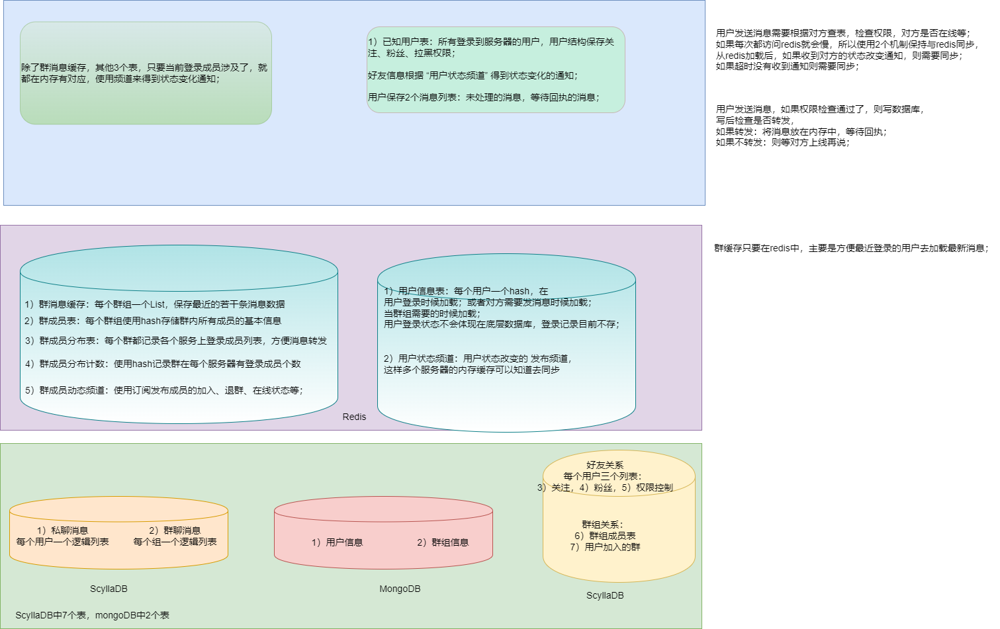

# 消息存储

存储的三级结构如下：




# 1. ScyllaDb存储

这里使用了一个snow雪花算法生成唯一的消息ID，使用高42比特来保存毫秒时间戳，12比特作为流水号，所以每个毫秒最多支持4096个流水号；

那么这个ID就可以代表时间了，所以我们可以用它来排序，或者得到时间；


## 1.1 传输结构

```protobuf
// 聊天存储的基本信息
message MsgChat {
  int64 msgId = 1;                // 消息的全网唯一标识，服务端使用雪花算法生成，因为客户端生成的不可靠
  int64 userId = 2;               // 用于存储的clusterKey，因为一份消息要存储2次，要转发，需要有这个字段

  int64 fromId = 3;              // 发送消息的用户 ID
  int64 toId = 4;                // 接收消息的用户 ID（对方的用户 ID）

  int64 tm = 5;                   // 消息的时间戳

  string devId = 6;               // 多设备登录时的设备 ID
  string sendId = 7;              // 用于确认消息的发送 ID

  ChatMsgType msgType = 8;        // 消息类型，建议使用枚举
  bytes data = 9;                 // 消息的内容，可以使用 bytes 存储二进制数据或文本数据

  MsgPriority priority = 10;      // 消息的优先级，建议使用枚举
  int64 refMessageId = 11;        // 引用的消息 ID，如果有的话

  ChatMsgStatus status = 12;      // 消息状态，建议使用枚举
  int64 sendReply = 13;           // 发送消息的回执状态
  int64 recvReply = 14;           // 接收消息的回执状态
  int64 readReply = 15;           // 已读状态的回执

  EncryptType encType = 16;       // 加密类型
  ChatType chatType = 17;         // p2p, group, system
  int32 subMsgType = 18;          // 传递给插件区分代码，插件都注册为整数类型，
  int64 keyPrint = 19;            // 秘钥指纹
}
```
在传输过程中，私聊和群聊的消息是共用的；

**服务为了保存到数据库需要进行格式转化：**

## 1.2 私聊

私聊是写扩散，所以需要在表中对每个人都写一次，区别在于uid1和uid2交换一次，pk肯定也是需要交换的

```go
type PChatDataStore struct {
	Pk   int16 `db:"pk"`
	Uid1 int64 `db:"uid1"`
	Uid2 int64 `db:"uid2"`
	Id   int64 `db:"id"`
	Usid int64 `db:"usid"`
	Tm   int64 `db:"tm"`
	Tm1  int64 `db:"tm1"`
	Tm2  int64 `db:"tm2"`

	Io    int8   `db:"io"`  // 0=out, 1=in
	St    int8   `db:"st"`  // 0=normal, 1=送达,2阅读，
	Ct    int8   `db:"ct"`  // 0=p2p_plain, 1=system, 2=p2_encrypted,
	Mt    int8   `db:"mt"`  // 0=text, 1=pic, 2=
	Print int64  `db:"pr"`  // 秘钥哈希的低8字节作为指纹
	Ref   int64  `db:"ref"` // 引用
	Draf  []byte `db:"draf"`
}
```

对应的建表语句：

```sql
const cqlCreateTablePChat = `CREATE TABLE IF NOT EXISTS  chatdata.pchat (
			pk smallint,
			uid1 bigint, 
			uid2 bigint,
			id bigint,
			usid bigint,
			tm bigint,
			tm1 bigint,
			tm2 bigint,
			io tinyint,
			st tinyint,
			ct tinyint,
			mt tinyint,
			draf blob,
			pr  varint,
			ref varint,
			PRIMARY KEY (pk, uid1, id)
		)`
```

这里提供了如下几个函数：

```go
// 写2次，首先是发方A，然后是收方B
func (me *Scylla) SavePChatData(msg *model.PChatDataStore, pk2 int) error

// 对发送方设置回执，收方不需要设置，这里提供了收方的参数，是为了兼容，以后也许也保存
func (me *Scylla) SetPChatRecvReply(pk1, pk2, uid1, uid2, msgId, tm1 int64) error
func (me *Scylla) SetPChatReadReply(pk1, pk2, uid1, uid2, msgId, tm2 int64)
func (me *Scylla) SetPChatRecvReadReply(pk1, pk2, uid1, uid2, msgId, tm1, tm2 int64) error

// 设置删除，不可逆
func (me *Scylla) SetPChatMsgDeleted(pk1, pk2, uid1, uid2, msgId int64) error

// 查找
func (me *Scylla) FindPChatMsg(pk, uid, fromId int64, pageSize uint) ([]model.PChatDataStore, error)
```


## 1.3 群聊

```go
type GChatDataStore struct {
	Pk   int16 `db:"pk"`
	Gid  int64 `db:"gid"`
	Uid  int64 `db:"uid"`
	Id   int64 `db:"id"`
	Usid int64 `db:"usid"`
	Tm   int64 `db:"tm"`
	Res  int8  `db:"res"` // 保留
	St   int8  `db:"st"`  // 0=normal, 1=送达,2阅读，
	Ct   int8  `db:"ct"`  // 0=普通，1=广播
	Mt   int8  `db:"mt"`  // 0=text, 1=pic, 2=

	Print int64  `db:"pr"`  // 秘钥哈希的低8字节作为指纹
	Ref   int64  `db:"ref"` // 引用
	Draf  []byte `db:"draf"`
}

```

去掉了uid2和tm2, tm3  群聊的消息不保存回执，多次读，每个用户都自己去读；

```cql
const cqlCreateTableGChat = `CREATE TABLE IF NOT EXISTS  chatdata.gchat (
			pk smallint,
			gid bigint,
			uid bigint, 
			id bigint,
			usid bigint,
			tm bigint,
			res tinyint,
			st tinyint,
			ct tinyint,
			mt tinyint,
			draf blob,
			pr  varint,
			ref varint,
			PRIMARY KEY (pk, gid, id)
		)`
```

相关函数如下：

```go
// 保存
func (me *Scylla) SaveGChatData(msg *model.GChatDataStore) error

// 查找
func (me *Scylla) FindGChatMsg(pk, gid, fromId int64, pageSize uint) ([]model.GChatDataStore, error)

// 设置删除，不可逆
func (me *Scylla) SetGChatMsgDeleted(pk, gid, msgId int64) error
```

消息的所有者，以及管理员可以设置删除消息，这里的删除等同于微信的撤回，而不是本地删除；


#   2. Redis缓存


