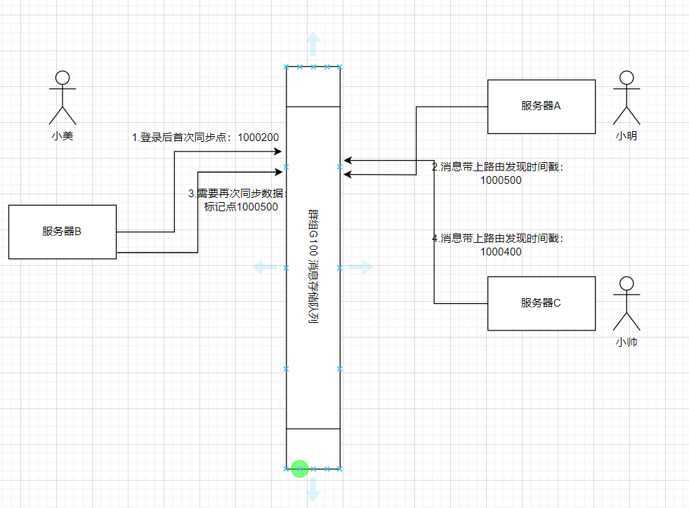

# BirdTalk IM集群中消息流转策略讨论

目前群聊的存储策略是1写多读方案；每个群组一个队列，按时间顺序排列，不区分用户；

私聊的存储是写扩散的，每个人都有自己的消息队列，按时间顺序 保存所有的消息，不区分会话；


# 1、单机模式

## 1.1 私聊消息

登录的算法，要求用户按照ID指定的服务器，而不是按照IP，这是因为ip经常发生变动；用ID可以保证各个会话终端都在一个服务器上；

私聊有3类确认：

1）服务器入库的成功回执；

2）对方给的送达回执；

3）阅读回执；

客户端需要一个定时器，对发送的消息监控，如果30秒没有回复成功，认为发送失败；最多尝试3次；

对于没有送达回执的消息，需要向服务区发送查询请求，（回执可能丢失），查询回执会让服务器对在线用户尝试重发；只要客户端实现的正确的，就肯定不会丢消息并应答送达回执；阅读回执可有可无；

## 1.2 群聊消息

对于单机的群聊，对于内存中没有的用户，就是不在线的，不转发数据；

当群聊用户某个时间点登录，那么先做准备工作，标记自己状态，然后开始同步历史数据，这样能保证数据


# 2、集群模式

不同于TINODE集群直接使用RPC连接，而是使用消息队列同步消息，当一条消息需要从一台服务器路由到另一一台服务器时，可以使用kafka的一个主题来实现，每个服务器一个单独的主题用于接收；这比每对服务器都要建立一个连接好多了，如果集群有1000台服务器，那么就需要1000个TCP连接。


路由可以使用redis辅助实现，为了及时通知对方发现路由变更，也需要使用一个公共的主题来广播消息。


## 2.1 私聊消息

假如有服务器A和服务器B，小明在服务器A，小美在服务器B；

开始时候小美不在线，消息都写入了小美的消息队列；当某一时刻，小美在服务器B登录，那么：

1）先告知集群当前此用户的此会话在服务器B；

2）执行一次同步历史数据之后，准备接收来自其他服务器用户的数据，当然也包括服务器A;

这里存在一个问题：

服务器A上的小明发现小美上线前，将数据写到了小美的消息队列，但是其实此刻，小美已经上线并且同步完数据了；那么这条消息就会被服务器遗漏，小美客户端也无从得知该条消息；

这个问题的产生主要是路由状态的扩散需要时间，异步的同步历史数据会造成潜在的数据丢失。

但是，与群聊不同，私聊是有回执的；当小明发现小美一直都没有回复接收回执，则会一直查询回执，服务器A会重发消息，此时如果发现了消息路由在服务器B，可以保证消息重发而不丢失；

但是有个缺点也很明显：有可能之前丢失的消息会在客户端出现乱序！！！


## 2.2 群聊消息


假如有服务器A和服务器B，一个群组G100；小明在服务器A，小美在服务器B；

当小美在服务器登录时间不确定的时候如何保证群聊消息不丢失？

可能会丢失的原因在于：

1）分布式环境下，消息的编号不是连续的流水号，无法通过编号来判断是否发生了丢失；

2）登录后如果只与服务器B同步一次数据，同步数据与其他服务器发现路由有时间差，时间差内的消息会丢失；


那么处理方式也很明显：

**1）传统轮询模式：**每次查询都告知服务器最后一条的ID，然后从数据库表中查询后续的消息，对于scylladb来说肯定是比传统的数据库强，但是效率仍然很低；

**2）暴力的集群同步：**不管服务器B是否有G100群组的用户在线，一直连续不断的转发消息，那么可以服务器B上存在的消息在时间上是连续的，那么登录后，同步一次数据就可以保证与后续转发的数据无缝衔接；

## 2.3 优化解决方法

那么针对2种方案时候有优化的方案呢？矫正后的算法对私聊和群聊都有效，原理是执行有限次同步以便在时间上覆盖所有范围：

**3) 时间戳矫正法：**

小美在服务器B登录，就绪后将状态广播到集群，之后开始同步群G100的历史数据，记录下同步到的最后一条消息的ID；假设同步的最新一条数据编号LAST_ID=1000200；(真实环境使用雪花算法) 

这个LAST_ID本质上记录的是同步点；同步点仅仅随着同步查询动作而更新；

**可能一**：服务器A早就发现服务器B有群组G100其他用户，一直在转发数据，那么小美不会丢失数据，因为是流程是先设置状态后同步数据，服务器B可以保证消息没有丢失；对于同步前收到的数据，客户端先写到本地库，同步数据完成后再显示就不会乱序；

**可能二：**

小美开始是离线状态，等到小美上线服务器B，将状态发布到集群；服务器A收到群组G100到服务器B的路由；此时服务器A针对此路由，应当记录一个发现路由的时间戳（START_TM），并在在此后所有针对此路由的转发的消息都需要带上这个时间戳START_TM，含义是从此时刻起开始转发消息；（加入针对这个路由发送的第一个消息ID为 1000500，这个时间戳可以设置为发现路由后转发的第一条消息ID）;


服务器B收到消息后，比对时间戳，如果 `LAST_ID >= START_TM` 则说明同步的的时间范围与开始转发的时间没有时间差；（在**可能一**中，也是满足这个不等式）。

如果` LAST_ID <  START_TM` 则说明存在时间差，有丢失消息风险，应该按照范围再1次执行同步数据，这样就能保证消息不丢失。同步消息后更新LAST_ID，含义是同步点可以标记到当前位置。

后续，假如有服务器C转发过来数据，也是同样大道理:   **因为消息ID虽然不连续，但是雪花算法单调递增，而且里面包含了时间戳；**

只要**同步点**晚于**路由发现时间**，就可以保证消息没有遗漏。



当服务器B上所有的关于群组G100的用户都离线后，则不需要服务器A转发数据了，则删除该路由。


相关代码：

```go
// 发送方
type RouteData struct{
	MemCount int64  // 当前服务器上群组活动人员数量
    StartTm  int64  // 发现路由的时间戳，
}

// 在群组中添加2个映射记录数据
type Group struct{
    GroupId  int64
    ...
    RouteMap     map[string]*RouteData  // 发方：发现到某路由时候设置时间戳
    
}


```

```go
// 收方：
// 由于用户支持多终端同时在线，所以路由其实记录的用户的会话，而不是用户本身，有可能出现同一个用户登录到不同的主机上；
type Session struct{
     Sid  int64
    ...
     GroupSynId map[int64]int64        // 收方：每个组同步操作得到的位置：groupId ->  LAST_ID
}
```

当服务器B有群组G100的用户时，会记录如下

```go
//lock
group.RouteMap["serverB"] = &RouteData{
	MemCount: 1,
	StartTm:  1000500，
}
```

当路由消失后，则删除此路由；


针对私聊采用类似的策略:

其中，有可能出现同一个用户登录到不同的主机上；

```go
type SessionOnserverData struct{    // 每个会话在哪个服务器上，记录首次发现路由的时间
    SessionList  []int64
    StartTm int64
}

// 有可能该好友的会话分布在多种终端，但是按照算法大多在同一个服务器
type UserRouteData struct{
    SessionOnServerMap  map[string]*SessionOnserverData   // 服务器——>会话列表
    
}


type User struct{
	UserId int64
    ...
    FriendRoute map[int64]*UserRouteData  // 针对好友的路由，UID-> 路由信息
}
```


```go
// 接收方，在会话中记录好友发来的最后的消息的LAST_ID，
type Session struct{
    Sid  int64
    ..
    LastSynPoint int64  //会话已经完成同步最新的ID，因为所有消息都存在在一起，不用区分好友
}
```

从上面可以总结：

收方记录的同步点是基于队列的；

群聊的路由发现是以服务器为单位执行转发；（减少处理的复杂度）

私聊的路由发现是基于服务器为单位执行转发；


## 2.4 收方消息处理

收方如果从消息队列拿到数据后，直接在线程池中处理，会造成用户数据的并发冲突，我们这里针对每个用户需要线性处理；

合适的方式是将消息分发到各个会话的消息缓存队列中，由会话的读协程来处理这个内容；